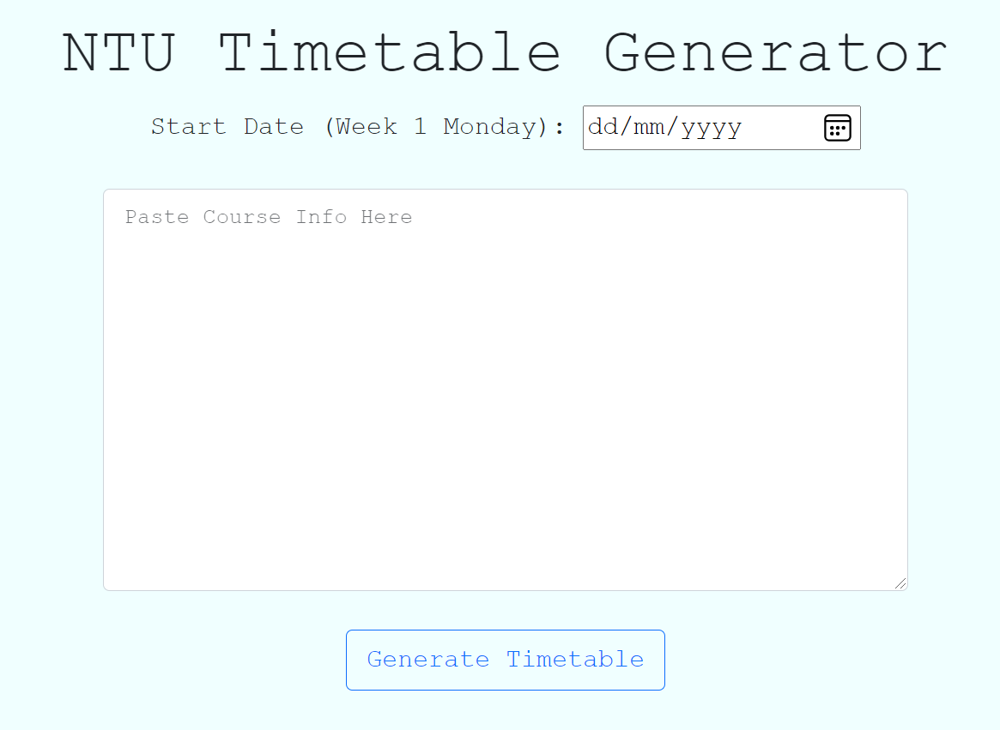

# NTU Timetable Generator

<b>Download your NTU Timetable as ics file for importing into calender! 📅</b>

## <a href="https://xjqx.github.io/NTU-Timetable-Generator">Website</a>

 

## Steps:
1. Access **Degree Audit** via iNTU Student Link
   - https://sso.wis.ntu.edu.sg/links/ugstudent.html
2. Click on **view Course Timetable** at the bottom of the page  

3. **Copy** all the course information as shown below (no need to copy the title) and **paste** on the NTU Timetable Generator Website  

4. On the NTU Time Table Generator Website, input the **Start Date** (Monday of 1st teaching week)
   - Teaching Weeks can viewed here: https://www.ntu.edu.sg/admissions/matriculation/academic-calendars
5. Click on **'Generate Timetable'**

##### `Credit: Done using Datebook module (https://datebook.dev/) to create ics file`
